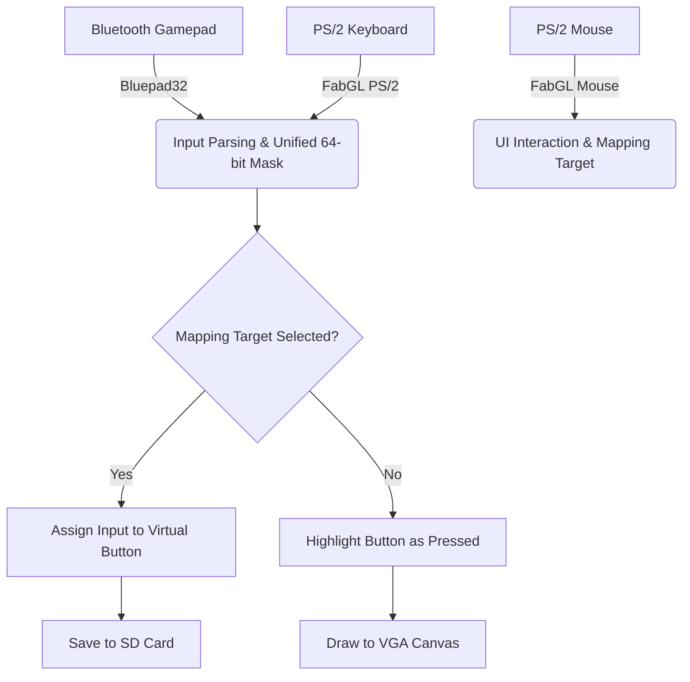
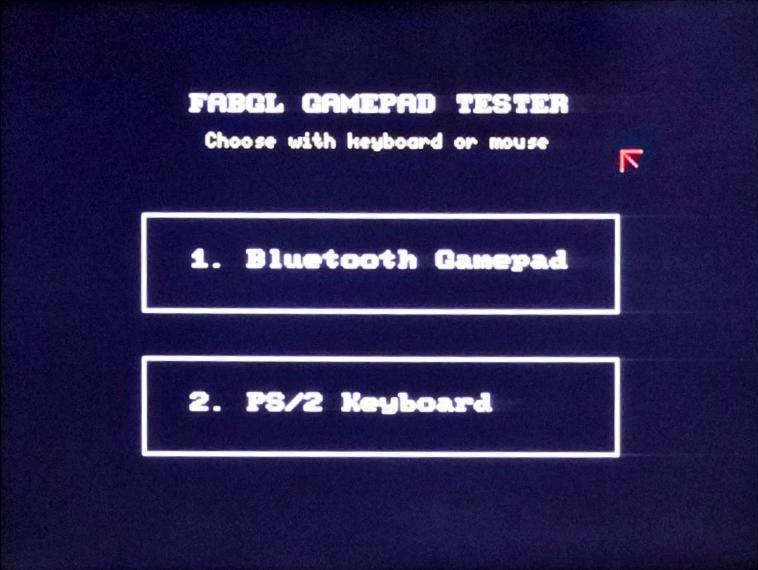
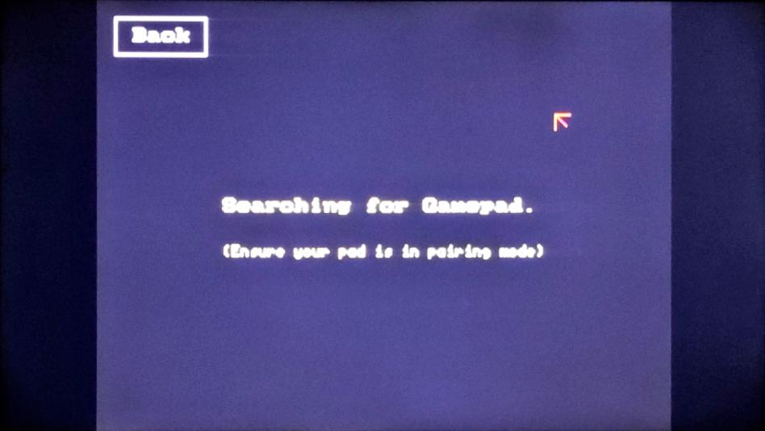
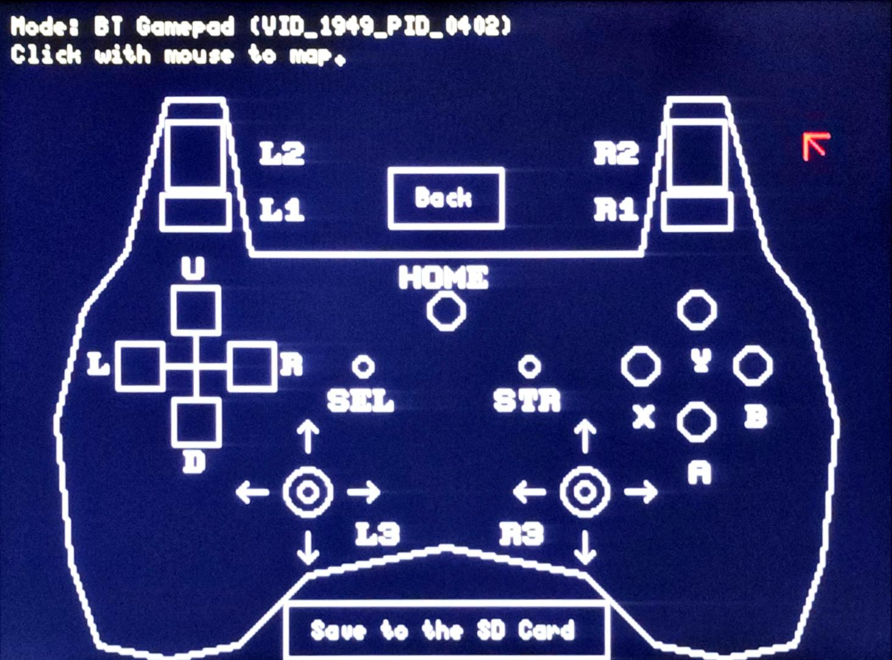

# FabGL Gamepad Tester & Configuration Mapper


A standalone, ESP32-based graphical tool built with **FabGL** and **Bluepad32**. 

The primary purpose of this project is to provide a robust, visual way to map physical Bluetooth gamepad buttons (or PS/2 keyboard keys) to a unified 64-bit input mask. The resulting configuration is exported to a MicroSD card. This allows other embedded projects and games to easily import the configuration file, saving developers the immense hassle of hardcoding button assignments or writing custom mapping user interfaces from scratch.

## 📑 Table of Contents
- [✨ Features](#-features)
- [💻 Hardware Requirements](#-hardware-requirements)
- [⚙️ Installation & Setup](#️-installation--setup)
- [🏗️ Architecture & Code Structure](#️-architecture--code-structure)
- [📝 Configuration File Format](#-configuration-file-format)
- [🧩 How to Parse the Config in Your Project](#-how-to-parse-the-config-in-your-project)
- [📸 Screenshots](#-screenshots)
- [📚 Libraries & Acknowledgements](#-libraries--acknowledgements)
- [⚖️ AI Disclosure & License](#️-ai-disclosure--license)

## ✨ Features
- **Dual Input Modes:** Supports standard Bluetooth Gamepads (Xbox, PlayStation, Generic) and PS/2 Keyboards.
- **Visual Feedback:** Real-time visual representation of button presses.
- **Dynamic Analog Simulation:** Real-time moving analog sticks and filling "glass" effects for analog triggers (L2/R2) based on pressure sensitivity (0-1023).
- **Point-and-Click Mapping:** Use a PS/2 Mouse to click on any virtual button on the VGA screen and press a physical button to map it.
- **SD Card Export:** Saves configurations locally, categorized by the connected gamepad's Vendor ID and Product ID (or MAC address if VID/PID is unavailable), or the PS/2 keyboard.

## 💻 Hardware Requirements

> [!NOTE]
> This project was developed and specifically tested using the **Olimex ESP32-SBC-FabGL** development board, which has all these components conveniently pre-integrated. However, it can work seamlessly with **any custom FabGL-compatible ESP32 board** once the pins are properly customized in the code.
> 
> For your hardware reference, the official schematic of the Olimex board used during development is included in this repository: [`ESP32-SBC-FabGL_Rev_B.pdf`](./ESP32-SBC-FabGL_Rev_B.pdf).

To run this project, you will need the following hardware components:
- **ESP32 WROVER Module** (Enabling PSRAM is highly recommended)
- **VGA Output Circuit** (Connected to pins: Red 21,22; Green 18,19; Blue 4,5; HSync 23; VSync 15)
- **PS/2 Ports** (Keyboard CLK: 33, DAT: 32 | Mouse CLK: 26, DAT: 27)
- **MicroSD Card Module** (SPI Pins: CLK: 14, MISO: 35, MOSI: 12, CS: 13)
- **Active Buzzer** (Pin 25)

## ⚙️ Installation & Setup

1. **Install Arduino IDE** and set up the ESP32 board manager.
2. **Install Required Libraries** via the Library Manager:
   - `FabGL` by Fabrizio Di Vittorio
   - `Bluepad32` by Ricardo Quesada
3. **Configure the Board:**
   - Board: `ESP32 Wrover Module`
   - Partition Scheme: **`Huge APP (3MB No OTA/1MB SPIFFS)`** *(Critical: FabGL requires this partition scheme to compile without memory errors).*
   - PSRAM: `Enabled`
4. **Compile and Upload** the sketch to your ESP32.

## 🏗️ Architecture & Code Structure

The project revolves around a unified state machine and a virtual button array (`vButtons`).



### Key Components:
- `BtnDef` **Struct:** The heart of the UI. It stores the screen coordinates `(x, y)`, radius `(r)`, button `name`, and the mapped values for both Bluetooth (`mapped_bt` as a `uint64_t`) and PS/2 Keyboard (`mapped_key` as a `uint8_t`).
- `drawTester()`: Responsible for rendering the PlayStation-style controller outline, the virtual buttons, and checking their `isPressed` states.
- `updateAnalogs()`: Reads raw analog values (X/Y axes and Brake/Throttle) directly from the hardware to simulate moving thumbsticks and dynamic trigger bars. It bypasses the mapping system because analog variables cannot be directly mapped to digital bitmasks.
- `saveConfig() / loadConfig()`: Handles the parsing and writing of the INI-style `.cfg` file using the standard Arduino SD library.

## 📝 Configuration File Format

When you click "Save to the SD Card", the program generates a file at `/Button_Config/mappings.cfg` on the MicroSD card. The file is structured similarly to an INI file.

If a Bluetooth Gamepad is used, the section header uses its MAC address (or Vendor ID / Product ID). If a keyboard is used, it falls back to `[PS2_KEYBOARD]`.

```ini
[TYP_0000_MAC_1097BDE2CA14]
A=1
B=2
X=8
Y=16
U=65536
L1=64
L2=0
...

[PS2_KEYBOARD]
A=97
B=115
U=273
...
```

> [!NOTE]
> For Bluetooth gamepads, the saved value is a **64-bit integer** representing the bitmask of the button.
> For PS/2 Keyboards, the saved value is the `fabgl::VirtualKey` integer representation.

## 🧩 How to Parse the Config in Your Project

If you are developing a game or a robotics project on the ESP32 and want to use this generated file, you should read the file during your `setup()` loop. 

Here is a conceptual example of how another program should parse and utilize this data:

```cpp
#include <SD.h>
#include <map>
#include <string>

// Store your mappings in memory
std::map<String, uint64_t> gamepadMapping;

void loadControllerMapping(String macAddress) {
    File file = SD.open("/Button_Config/mappings.cfg", FILE_READ);
    if (!file) return;

    String targetHeader = "[" + macAddress + "]";
    bool readingMyController = false;

    while (file.available()) {
        String line = file.readStringUntil('\n');
        line.trim();
        
        if (line.startsWith("[")) {
            readingMyController = (line == targetHeader);
        } else if (readingMyController) {
            int eqPos = line.indexOf('=');
            if (eqPos > 0) {
                String btnName = line.substring(0, eqPos);
                String maskStr = line.substring(eqPos + 1);
                
                // Convert string to 64-bit integer
                uint64_t mask = strtoull(maskStr.c_str(), NULL, 10);
                gamepadMapping[btnName] = mask;
            }
        }
    }
    file.close();
}

// Inside your main game loop:
void checkJump(uint64_t currentGamepadInput) {
    uint64_t jumpMask = gamepadMapping["A"]; // E.g., Button A is Jump
    
    if ((currentGamepadInput & jumpMask) != 0) {
        // Character jumps!
    }
}
```

> [!TIP]
> Always implement a default fallback mapping in your game in case the SD card is not inserted or the specific controller hasn't been mapped yet by the tester program.

## 📸 Screenshots

<div align="center">
  
  <p><em>Main Menu Interface</em></p>
  
  <br/>
  
  
  <p><em>Device Scanning and Connection Phase</em></p>
  
  <br/>
  
  
  <p><em>Gamepad Tester and Key Mapping Interface</em></p>
</div>

## 📚 Libraries & Acknowledgements

This project relies on the incredible work of the open-source community. Special thanks to:
- **[FabGL](https://github.com/fdivitto/FabGL):** An exceptional ESP32 Display and UI library by Fabrizio Di Vittorio. Used for generating the VGA signal, parsing PS/2 peripherals, and rendering the graphical canvas.
- **[Bluepad32](https://github.com/ricardoquesada/bluepad32):** The industry standard ESP32 Bluetooth gamepad host library by Ricardo Quesada. Used for connecting and parsing raw Bluetooth HID reports into usable structures.

## ⚖️ AI Disclosure & License

**AI Disclosure:** Portions of the code and documentation in this project were generated, structured, or refined with the assistance of Artificial Intelligence (Google DeepMind's Advanced Agentic Coding tools). 

**License:** This project is licensed under the **MIT License**. You are free to use, modify, distribute, and integrate this tool or its generated configuration files into your own commercial or non-commercial embedded projects.
